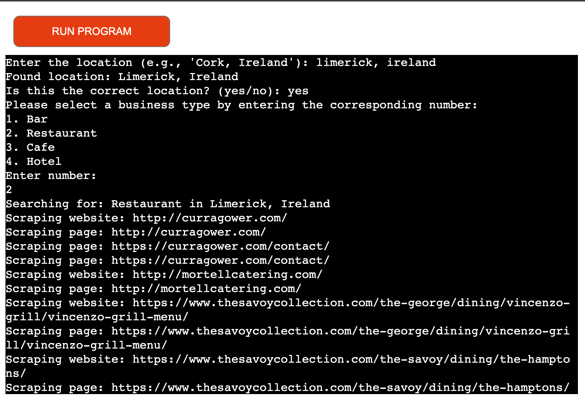
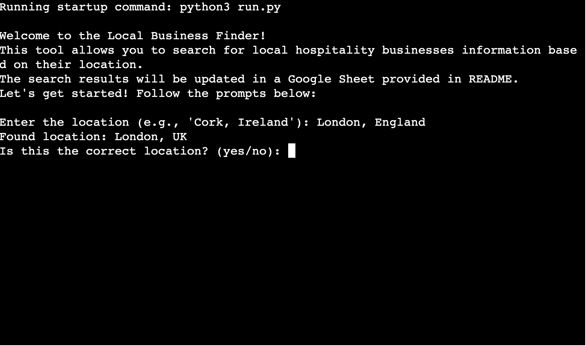
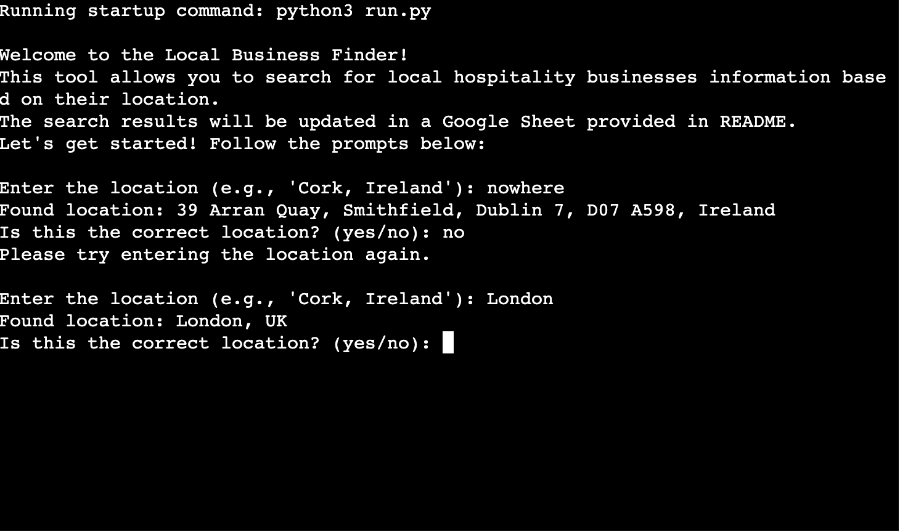

# Local Business Finder

Welcome to the Local Business Finder project! This is a Python-based application designed to assist users in discovering local hospitality businesses through Google Places API and advanced web scraping techniques. It looks to streamline those looking to gather business data based on specific locations, our tool simplifies the process of finding local hospitality services, from cafes and restaurants to bars and hotels. Not only does it help the discovery of business information, but it also enables you to save this data in a Google Sheet for easy access and management. It's worth noting that the information isn't saved automatically; users are responsible for transferring data from the Google Sheet to a more permanent CSV form if needed. Our goal is to save you time and make local business discovery considerably easier.

## Table of Contents

- [Introduction](#introduction)
- [Getting Started](#getting-started)
  - [Prerequisites](#prerequisites)
  - [Installation](#installation)
- [Key Features](#key-features)
- [Built With](#built-with)
- [Deployment](#deployment)
- [Configuration](#configuration)
- [Usage](#usage)
- [Screenshots](#screenshots)
- [Testing](#testing)
- [Contributing](#contributing)
- [Authors](#authors)
- [Considerations for Correcting](#considerations-for-correcting)
- [License](#license)
- [Acknowledgments](#acknowledgments)
- [Contact](#contact)

## Introduction

The Local Business Finder is a Python-based application designed to leverage the Google Places API and web scraping techniques to help users discover businesses in their desired locations. This tool is invaluable for identifying contact information, business types, and additional details to support local economies and provide accessible information. Whether you're conducting research, planning a visit, or simply exploring what your local area has to offer, the Local Business Finder is your go-to resource for up-to-date business information.

## Getting Started

To get this project up and running on your local machine for development and testing purposes, follow these simple steps. For notes on deploying the project on a live system, see the deployment section.

### Prerequisites

Before you begin, ensure you have the following software installed on your system:

- Python 3.8 or higher
- BeautifulSoup4
- gspread
- oauth2client
- Flask

### Installation

1. Clone the repository to your local machine:

   ```bash
   git clone https://github.com/yourproject/local-business-finder.git
   ```

2. Install the required dependencies:
   ```bash
   pip install -r requirements.txt
   ```
3. Configure your Google API credentials and update based on [Configuration](#configuration) section instructions.

## Key Features

- **Business Search**: Enables users to search for hospitality businesses by type and location, offering a tailored discovery experience.
- **Data Scraping**: Extracts contact information and additional details from business websites.
- **Google Sheets Integration**: Facilitates the automatic update of a Google Sheet with search results, allowing for easy data access and analysis.
- **User Interaction**: Offers a straightforward command-line interface for entering search criteria and navigating through the application with ease.

## Built With

- **Python**: The core programming language used for developing the application.
- **BeautifulSoup**: A library employed for web scraping, enabling efficient data extraction.
- **Google Maps and Places API**: Provides comprehensive business information to enhance search results.
- **gspread**: Facilitates integration with Google Sheets, enabling automatic data updates.
- **Heroku**: A cloud platform used for deploying the application, ensuring it is accessible to users worldwide.

## Deployment

This application is deployed on Heroku. Follow these steps for deployment:

1. Fork or clone this repository.
2. Create a new Heroku app.
3. Set up Config Vars in Heroku: `CREDS`, `GOOGLE_MAPS_API_KEY`, and `PORT`.
4. Connect your GitHub repository to Heroku and enable automatic deploys.
5. Deploy the main branch.

Refer to Heroku's official documentation for detailed steps.

## Configuration

When you create the app, you will need to add two buildpacks from the _Settings_ tab. The ordering is as follows:

1. `heroku/python`
2. `heroku/nodejs`

You must then create a _Config Var_ called `PORT`. Set this to `8000`

If you have credentials, such as in the Love Sandwiches project, you must create another _Config Var_ called `CREDS` and paste the JSON into the value field.

Connect your GitHub repository and deploy as normal.

Ensure the following environment variables are configured in your deployment environment:

- `GOOGLE_MAPS_API_KEY`: Your API key for Google Maps and Places.
- `CREDS`: A JSON string of your Google service account credentials for accessing Google Sheets.
- `PORT`: The port number on which your application will run, typically `8000` for local development.

2. Configure the following environment variables in your Heroku app:
   - `GOOGLE_MAPS_API_KEY`: Your API key for Google Maps and Places.
   - `CREDS`: A JSON string of your Google service account credentials for accessing Google Sheets.
   - `PORT`: Typically set to `8000` for local development.

## Usage

After deployment, access the application via the command line and follow the interactive prompts:



1. Input the desired location (e.g., "Cork, Ireland").

2. Confirm the loction fetched is the one you want to search

   

3. Choose a business type from the provided options from the list of hospitlaity businesses
4. Review the fetched business information updated in the specified Google Sheet and copy the info you want to keep and pastet it to your personal CSV file.
5. A new search will overwrite old data

Google Sheet Link: <a href="https://docs.google.com/spreadsheets/d/1SGr8HLTg4N9j9foBEQx93-e1qJEULERhQS-CKm7BSRo/edit?usp=sharing" target="_blank">Local Business Finder Results</a>
[click here](https://docs.google.com/spreadsheets/d/1SGr8HLTg4N9j9foBEQx93-e1qJEULERhQS-CKm7BSRo/edit?usp=sharing).

## Testing

This application has undergone multiple testing phases:

- Local testing for functionality and bug fixes.
- Heroku deployment testing to ensure proper environment variable configuration.
- Passed through PEP8 linter without errors
- We have added checks through the CLI to ensure the correct data is being fetched
  

- We have added errors if no data is input (we wanted to add a check for unknown locations to give an error but this involved Google Geolaction API integration as well, which I did not have time for)
- Correct deployment should have the following output
  
- Desired user objective is attained and ethical considerations taken into account by fetching only data readily available on Google Places API and saving that data to a source for that user.

## Contributing

We warmly welcome contributions to the Local Business Finder project. If you have suggestions, please open an issue to discuss what you would like to change or submit a pull request directly.

- Ideally, for future devlopement we would like to have more thorough name search for locations and error handling for incorrect names, this would involve integrating Google Geolocation API and we welcome any suggestions on an approach for this.

## Authors

- **Richard Goggin** - _Initial work_ - [My Github](https://github.com/dickiegog)

## Considerations for Correcting

- **Google API Key**: The Google API Key was initially hardcoded into the code. Although it was removed before pushing to GitHub, it was present in an old commit and thus logged into the commit history. My mentor advised that the best course of action was to mention it here.
- **Markdown Language Issues**: There have been issues with the Markdown language causing the Google Sheet link in this README not to open in a new tab, despite attempts to format it correctly.
- We would like the HTML scraping to be more thorough but we got to a stage a where we would have to try to bypass blockers so did not continue due to ethical considerations.
- My first commit (after intitial commit) may be larger as it contains the first running model of the app to work on, all commits after are interations on this.

## License

This project is for use for testing by Code Institute evaluators, it is not meant for personal use or commercial gain. We do not accept any responsibility for the misuse of the project.

## Acknowledgments

- Google Places API for providing extensive business data.
- BeautifulSoup for enabling efficient web scraping.
- The Code Institute for guidance and resources on project deployment, including the project template used for the build.
- Special thanks to the online developer community, especially contributions from Stack Overflow and Google Places documentation, for insights and solutions.
- To fully understand these API tools and the necessary code and format needed to use them, we mostly referenced Stack Overflow and Google Places, namely the below, so some overlapping may occur for layout and code structure for email/number references:
  [^1]: [Google Maps Address Validation Overview](https://developers.google.com/maps/documentation/address-validation/overview)
  [^2]: [Scrape right phone numbers using Beautiful Soup in Python - Stack Overflow](https://stackoverflow.com/questions/55957937/scrape-right-phone-numbers-using-beautiful-soup-in-python)
  [^3]: [Scraping email addresses Beautiful Soup - Stack Overflow](https://stackoverflow.com/questions/71166959/scraping-email-addresses-beautiful-soup)
  [^4]: [BeautifulSoup: How to extract email from a website - Stack Overflow](https://stackoverflow.com/questions/57944130/beautifulsoup-how-to-extract-email-from-a-website)

## Contact

For inquiries or contributions
, please contact [richard@theworkwall.com](mailto:richard@theworkwall.com).
